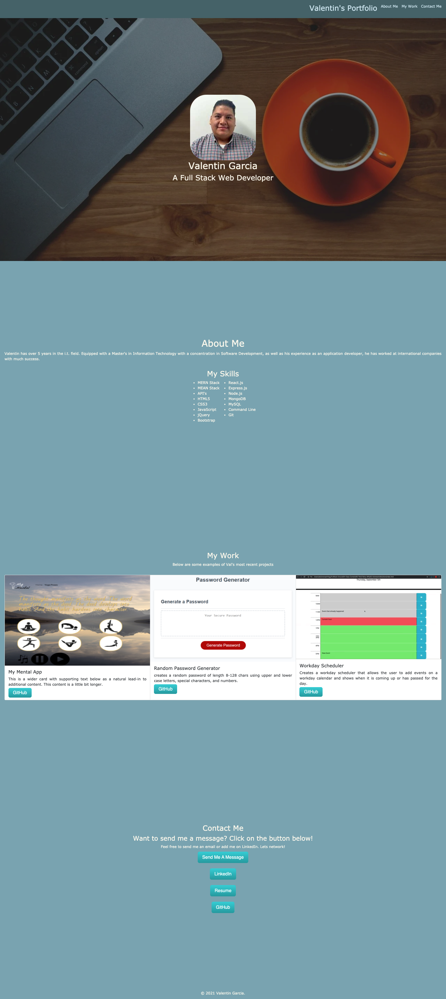

# Unit 08 Project 1 Homework: Professional Materials

## Installation
Link to working site:
https://valentingarcia-gh.github.io/Portfolio/

## Repository
Link to repository:
https://github.com/valentinGarcia-gh/Portfolio

## Description

I was tasked to include 3 projects I felt were exemplary to my portfolio. This time the portfolio
needed to have GitHub repo links to those projects, my resume in pdf format, and a link to my LinkedIn.

## Requirements

* Submit an updated portfolio featuring Project 1 and two exemplary homework assignments.

* Submit an updated GitHub profile with pinned repositories featuring Project 1 and two exemplary assignments.

* Submit an updated resume

* Submit an updated LinkedIn profile

## Result
Final screenshot of the portfolio page:
